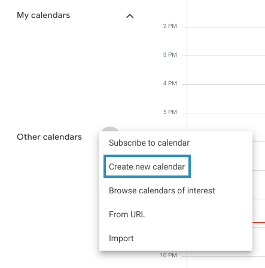
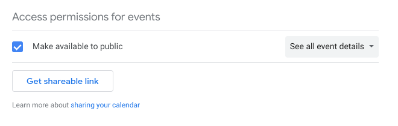
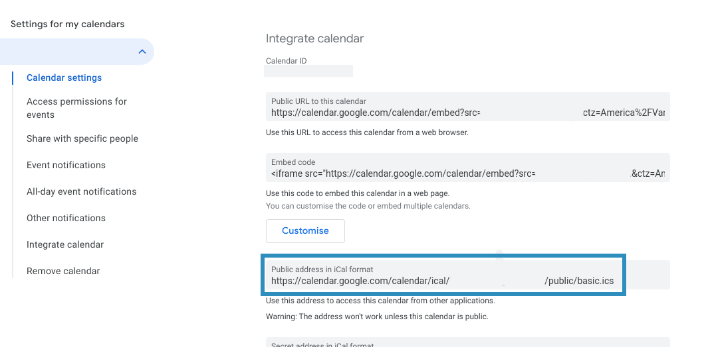
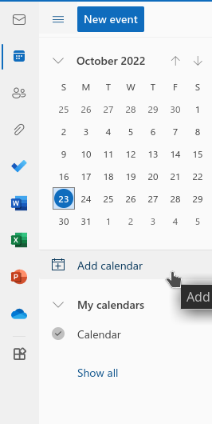
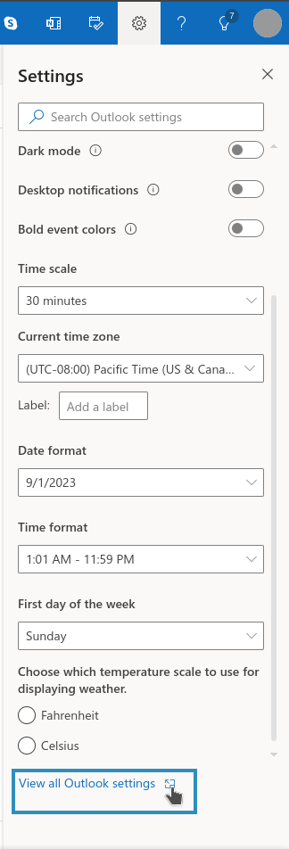
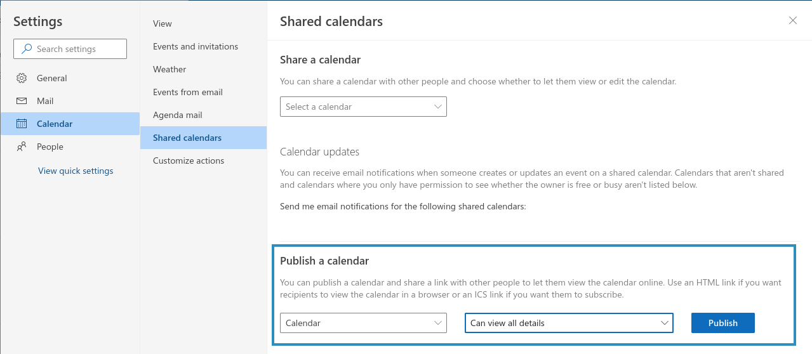
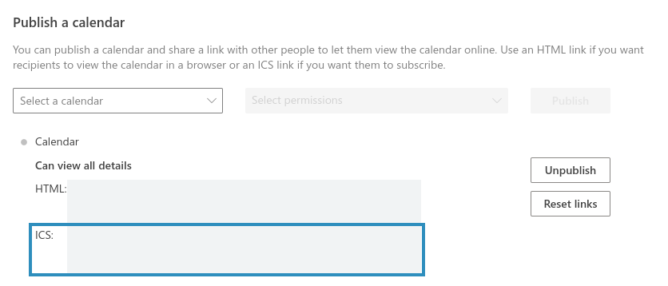

# How can a club add their ICS events to `/clubs`?

## Background

Our [clubs and partners page](https://ubccsss.org/about/partners/) has a club calendar. Its intention is to collect all CS-related events at UBC and to be a central events calendar for all CS-related clubs.

Under the hood, it uses [open-web-calendar](https://open-web-calendar.hosted.quelltext.eu/) to display events. It automatically pulls from our own events, hosted at [/events/index.ics](https://ubccsss.org/events/index.ics), which is itself automatically generated when we add new events to the website (see main repository README).

Other club executives can request that their club events be added as well by contacting a CSSS exec. Please ask them to provide a hosted ICS file (i.e. Google Calendar or Outlook) so events are automatically updated.

If other club execs need help setting up an ICS file from their club event calendars, direct them to this document and the following instructions.

## Google Calendar

If your club uses Google Calendar to share events with members already, it's easy to publish and find the ICS file link to be included in the CSSS club events calendar.

1. If your club doesn't already have a calendar, create a new calendar and add your club events.



2. Click on the 3 vertical dots beside the calendar and click 'Settings'. In the settings menu, scroll to 'Access Permissions' and click 'Make available to public', choosing 'See all event details'.



3. Scroll down to 'Integrate Calendar', and send the link in the 'Public address in iCal format' box to a CSSS exec.



## Outlook

Similar instructions can be followed if your club uses Outlook.

1. If your club doesn't already have a calendar, create a new one and add your club events.



2. Click the settings cog in the upper-right, and scroll down to the bottom to 'View all Outlook settings'.



3. In the settings page, choose the calendar and change the visibility to 'Can view all details'. Click publish.



4. Once published, send the ICS link that appears below the 'Publish a calendar' heading to a CSSS exec.



## Adding an ICS file to the shortcode

Once a hosted ICS file has been provided, edit [content/about/partners.md in this repo](https://github.com/ubccsss/ubccsss.org/blob/master/content/about/partners.md) to include their ICS link in the shortcode at the bottom of the file.

For example, to add "https://example.com/example.ics" to the club calendar:

```

```
